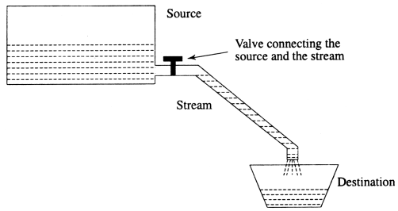

# Java Streams

This repository contains Java code examples that demonstrate how to work with streams. Streams are a powerful and efficient way to process large amounts of data in Java, and can be used for a variety of purposes, such as reading and writing data, filtering and sorting data, and transforming data. The examples in this repository cover basic stream operations, such as creating streams, filtering data, sorting data, and aggregating data, as well as more advanced stream operations, such as parallel streams and collectors.

## Java Files and Streams Summary:
 * Storing and manipulating data using files is known as file processing
 * Reading/Writing of data in a file can be performed at the level of bytes, characters, or fields depending on application requirements.
 * Object Serialization: The process of reading and writing objects
 * Java Uses the concept of Streams to represent the ordered sequence of data, a common characteristic shared by all I/O devices
 * Streams presents a uniform, easy to use, object oriented interface between the program and I/O devices
 * A stream in Java is a path along which data flows (like a river or pipe along which water flows)
 
 *
 *
 *
 *
 *
 *
 *
 *
 *
 *
 *
 *
 *
 
